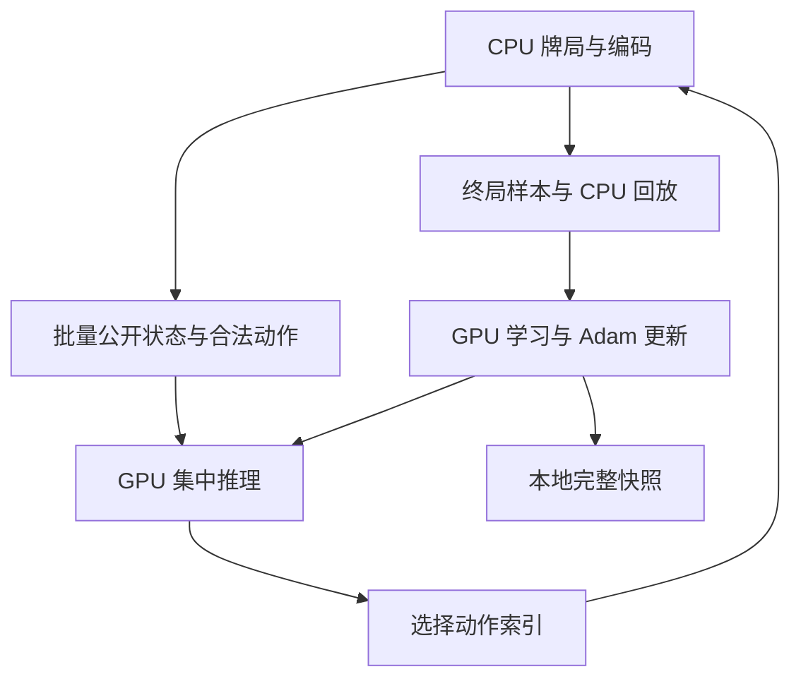

# DouGPU 本地 GPU 迁移分析与实现

日期：2026-09-30。来源：用户上传的 `DouTPU_v6e1_Optimized_Final.ipynb`。

2026-10-01 项目名称统一为 DouGPU。本文保留迁移当时的设计与验证边界，当前安装、入口与后续实测以根目录 [README](../README.md) 和后续验证报告为准；来源 notebook 的文件名不改写。

## 结论与交付范围

notebook 内嵌项目已迁移为可独立启动的本地 Python 工程。迁移保留 JAX 训练架构，显式选择 CUDA 后端，并按目标硬件分阶段测量执行参数。项目提供独立安装、硬件诊断、固定规则源码、完整 checkpoint 导入、预检、训练与续训、分阶段调参、独立牌局评估及可选 Docker 支持。

基线计算路径已通过 CPU 正确性和流程验证。交付环境没有 RTX 5070、CUDA 设备或 Docker daemon，尚未测量目标机器的吞吐、显存峰值或最优配置。GPU 前向、梯度验证及测量脚本已实现，需在目标机器上运行并保存报告。验证范围见 `validation-notes.md`。

## 一、先对照原架构

### 1.1 notebook 内嵌的是完整 JAX 工程

附件包含 18 个 cell，代码 cell 中有可核验的 Base64 ZIP。解码后的原始源归档 SHA-256 为：

```text
90f6376821913dec3424bed69fe06536d6801784b152dbe5db57f40b03434371
```

迁移以该归档中的源代码为基础，原文件哈希保存在 `notebook_source_manifest.json`。原文档保留在 `TPU_ORIGINAL_*` 文件中，可用于查阅历史设计；其中的 TPU 实测和旧测试记录不作为本 GPU 项目的验证结果。

| 原组件 | 核实后的职责 | 本次处理 |
|---|---|---|
| `environment.py` | 使用固定提交的 DouZero 规则，精简观察对象构造 | 保留规则实现和提交 |
| `actors.py` | spawn 多进程，进程内多局；仅 CPU 运行规则/编码 | 保留，调整运行并行度 |
| `encoding.py` | 公开历史、自家手牌、公开状态及候选动作 | 保留信息边界与完整历史 |
| `inference.py` | 历史编码一次，所有合法动作分块评分和 argmax | 保留，增加显式 attention 实现选择 |
| `model.py` | 小型因果 Transformer + 三角色 Q 头与辅助头 | 保留参数和损失，增加可选 cuDNN 路径 |
| `replay.py` | NumPy 回放环、角色平衡采样、预取、历史分组 | 保留，测量不同执行形状 |
| `train.py` | 采样/学习阶段、评估、日志、保存 | 增加明确后端、会话指标和迁移检查 |
| `checkpoint.py` / `fork_run.py` | ZIP/NPZ、哈希、提交标记、完整学习状态恢复 | 适配本地路径，支持校验后迁入新实验 |

运行关系如下。同一 GPU owner 内的推理和学习按原阶段调度，图中不是两个独立 GPU 服务：



### 1.2 模型规模与目标

原模型是 3 层、宽度 128、2 个注意力头、每头 64 维、FFN 512、最大历史 512 token，包含 RMSNorm、RoPE、Q/K normalization 和 SwiGLU。根据原 `init_params` 的参数形状计算，共 **922,401 个参数**。

| 数据 | 大小或语义 |
|---|---|
| 模型 FP32 参数 | 约 3.52 MiB |
| Adam 的 m/v 两组 FP32 状态 | 约 7.04 MiB |
| 65,536 行回放的基础数组 | 约 41.375 MiB，不含 Python 对象/在途轨迹/序列化副本 |
| 私有/公开状态向量 | 21 维，包括当前玩家手牌与公开状态 |
| 候选动作特征 | 16 维 |
| belief 标签 | 30 维，仅作为辅助监督标签 |
| 有效训练批量 | micro 32 × accumulation 8 = 256 |

在 12 GB 显存下，主要需要测量激活、注意力中间张量、反向与编译工作空间的占用，不能仅凭“12 GB”决定缩小模型。例如，一层 `[32, 2, 512, 512]` FP32 注意力 logits 占 64 MiB；整次训练的显存峰值还需实测。

原目标为：

```text
loss = Q 的 Monte Carlo MSE + 0.02 × NTP loss + 0.05 × belief MSE
```

采用终局胜负 ±1 回报，两位农民共享团队回报。它不是含 target network 的 DQN 更新。AdamW 保留 beta=(0.9,0.999)、eps=1e-8、全局梯度裁剪 1.0，以及仅对二维及以上参数施加 weight decay 的原规则。

每周期收集额度 2048，执行 4 次 batch=256 更新，名义学习样本复用比为 `4×256/2048 = 0.5`。sample credit 会跨周期结转；不能对单个周期的 `fresh_samples` 直接取倒数解释长期吞吐。

## 二、对照目标硬件与软件支持

| 项目 | 官方资料与本机约束 | 对实现的影响 |
|---|---|---|
| Intel Core Ultra 5 245KF | 14 核 / 14 线程，6P + 8E，最高 5.2 GHz，AVX2 [H1] | TPU 配置的 32 个 Python actor 不能照搬；起点 8 个，单线程数值库 |
| 桌面 RTX 5070 | Blackwell、6144 CUDA cores、12 GB GDDR7，672 GB/s [H2][H3] | 使用 BF16 GPU 主干；根据实测调整批量、注意力和重计算 |
| CUDA 架构 | 计算能力 12.0 [H4] | 使用支持该卡的 CUDA 编译器和驱动，避免误用旧架构 wheel |
| 系统内存 | 用户此前提供 32 GB | 回放数组容量可保留；为系统、WSL/容器、编译及保存副本留空间 |
| 操作系统 | JAX CUDA 支持 Linux；原生 Windows 不支持，WSL2 标为 experimental [H5] | 同一工程用于原生 Linux / WSL2 Ubuntu |

这 14 个 CPU 核心分为性能不同的 P 核和 E 核。代码不假定编号 0 至 5 就是 P 核，也不在未经测量时自动绑核。`doctor` 记录可见 affinity、cgroup 配额和可读取的 topology/frequency 信息，actor 数量由分阶段测量决定。

### 固定依赖的理由

保留 notebook 使用的 JAX 0.7.2。其版本专属包元数据提供 CUDA 13 extra [H6]。但只固定 `jax[cuda13]==0.7.2` 并不能固定全部 NVIDIA 依赖；因此还固定了 CUDA runtime、编译器及每个库的准确版本。

选择 CUDA 13.0 Update 2 官方组件组合 [H7]，加上明确支持 CUDA 13.0 和 CC 12.0 的 cuDNN 9.18.1 [H8]。项目解析得到 22 个准确固定的依赖，记录在 `dependency_resolution.json`。对应原生 Linux 驱动建议为 580.95.05 或更新。WSL 使用 Windows 宿主驱动，不能在 WSL 内安装 Linux 显示驱动 [H9]。

硬件和库的支持文档不能代替 JAX kernel 实测。即使 cuDNN 能识别 Blackwell，仍须在用户 GPU 上通过预检，逐项验证实际使用的 JAX 形状与梯度路径。

## 三、按阶段迁移的实际改动

### 阶段 A：消除 Colab 与 TPU 的入口绑定

新增 `run_local.py`：明确划分 prepare、import-checkpoint、doctor、selftest、preflight、train 和 evaluate。去掉 notebook 运行入口对 `/content`、Drive mount、Colab 魔法命令的依赖，路径均由本地实验目录决定。

原 `train.py` 和 `optimization_benchmark.py` 中，`require_tpu=False` 会设置 `JAX_PLATFORMS=cpu`，因此仅关闭 TPU 开关仍会在 CPU 上训练。修复后，`TrainConfig.backend` 可显式选择 `cuda`、`cpu`、`tpu`，在初始化前统一设置并验证实际后端。CUDA 配置不会静默使用 CPU。

遗留 `require_tpu` 保留用于读取原配置。新增执行设置放在 TrainConfig，原 ModelConfig 字典及权重名称/形状保持不变，便于完整 checkpoint 迁移。

### 阶段 B：本地数据与快照恢复

`prepare` 为新代码生成独立来源锁，并复制已验证的固定规则归档。`import-checkpoint` 使用新实验目录，对原 checkpoint 进行归档哈希、成员哈希、完整参数、Adam step 与学习语义核对后写入新快照。

保留的状态包括 params、Adam m/v/step、champion、replay、主 NumPy RNG、cycle/updates/frames/games/complete_samples 和 sample credit。有效 batch、fresh_samples、updates_per_cycle 或 replay age 不同时，检查会拒绝将其作为纯性能迁移。

原 notebook 输出中的历史 updates 数值无法还原参数。附件没有训练权重与回放，本轮因此使用实际序列化的测试快照验证完整导入流程和状态保持，未导入用户的真实 TPU 学习状态。policy-only NPZ 会被拒绝作为完整续训源。

`Ctrl+C`/SIGTERM 由 launcher 转发到 learner，再等待其安全保存。项目锁防止多个本项目训练/预检流程同时竞争 GPU，实验锁阻止同一目录的重复写入。长时间运行继续保留原 checkpoint 校验、三代保留与可选第二份镜像。

### 阶段 C：为 245KF 调整 CPU 分工

默认 8 workers × 8 局 = 64 局，两个有序 actor 组，每组推理 batch 32。数值库线程设置发生在 NumPy/JAX 导入前；默认每进程 1 线程，避免多进程再乘以 BLAS 线程数。需要特殊实验时通过 `DOUGPU_NUM_THREADS` 显式覆盖并记录。

保留 packed 请求/样本、原有有序 replay 插入和探索 RNG 顺序、集中推理。没有把小模型复制到每个 actor，也没有引入多份 CUDA context。增加并行牌局的候选阶段，使 GPU batch 可扩展到 64/128，而不必先增加更多 CPU 进程。

### 阶段 D：CUDA 计算候选

默认 `manual` attention 保留 notebook 的显式数学实现；这是迁移对照基线。新增两个执行实现：

| 路径 | 用途 | 数值与形状约束 |
|---|---|---|
| `manual` | 原路径，默认 | 维持原 softmax BF16 cast 等运算顺序 |
| `xla` | 使用 JAX SDPA API 的诊断对照 | 保持 causal/PAD-key 语义；不作为自动选优结果 |
| `cudnn` | 目标 GPU 融合注意力候选 | BF16；有效前缀与右 PAD；显式指定实现，不自动 fallback |

cuDNN 路径用序列有效长度表达 PAD，避免代码显式创建平方大小的注意力 mask/bias。保留 Q/K normalization、RoPE、完整历史和因果性。输入主机侧验证拒绝内部 PAD 或长度后的脏 token；直接 JAX 编码函数依赖这个已检查的输入约定。有效 token 的输出/损失具有相同数学含义，原始 PAD 位置 hidden state 不属于相等保证范围。

FP32 参数和 Adam 状态、FP32 归一化及最终 Q/loss 保留。融合核、归约顺序和 TPU→GPU 数值变化意味着不能声称 BF16 逐位一致；预检提供误差指标，并检查损失和全部参数梯度。[H10]

更大微批按 `32×8 → 64×4 → 128×2` 比较，也提供 `16×16` 候选。`learner_remat` 已作为运行时覆盖使用，不改 ModelConfig。所有候选保持有效 batch=256，完整历史与合法动作数量保持。

### 阶段 E：预检与有意义的性能测量

原预检虽然分配 512 宽张量，实际仅填 6 个 token、`lengths=6`。新预检生成真正的非 PAD 64/128/256/512 token，执行所选完整模型的真实反向与优化器更新，确认有限数值、参数变化和 Adam step 增长；动作选择同时覆盖全部历史桶、超过 chunk 的尾部最优动作及首个并列最大值。

预检区分首次编译+执行与暖态更新时间，记录依赖、设备和可用的 JAX 显存统计。history groups 的 all-equal 形状预热不代表所有混合 tuple 都已预热：4 个历史桶和 4 个排序组最多有 35 种非递减宽度组合。训练日志额外记录实际 `learner_shapes`，后出现形状的编译成本保留在实测时间中。

`tune_local.py` 使用同一冻结快照，为每个候选的每次重复依次执行 prepare → import → preflight → train。默认只生成计划和预算，不启动长时间网格搜索；加上 `--execute` 后才执行一个阶段。预检失败即停止，不继续训练，也不改用更轻的任务。

计时采用 JAX 的实际完成同步边界 [H11]，主要指标是：

```text
完整周期有效更新速度 = Σ updates_completed / Σ full_cycle_seconds
```

该指标计入评估、周期内存盘和采样开销。报告另列 learner-only、selfplay decisions、padding、形状，以及未计入的启动和尾部时间，不将这些不同口径混为“frames/s”。计数只取最后一个会话，排除导入的历史日志。

对非有限步、内段周期缺失、checkpoint 失败、计数器不一致或退出失败的 trial 不给有效排名。正常时间上限导致的最后不完整周期可以排除，其耗时会披露。没有足够暖态采样、完整评估及周期保存的窗口会标为证据不足。

## 四、运行顺序与优化决策

最短可用路径：

1. 安装固定依赖，执行 `doctor`，确认是真实 CUDA。
2. `prepare` 新实验，并按需要导入完整 TPU checkpoint。
3. 执行 `selftest`、完整模型 `preflight`。
4. 运行额外两周期 smoke，确认成功更新和保存；再从同目录续训。
5. 根据完整周期分项，先选 CPU workers/并行牌局，再选推理/learner，最后测 cuDNN 或重计算。

建议按观测证据处理瓶颈：

| 实测现象 | 优先比较 |
|---|---|
| collection 时间占比很高，GPU 经常等待 | workers、每 worker 牌局数、推理 batch 对齐 |
| inference 开销高，动作 padding 大 | fused、action chunk；检查所有动作仍在 |
| learner 占比高 | 等效批量重排、remat 开关、cuDNN |
| 编译突刺多 | history groups=1/2/4、实际形状日志、可信本地 JAX 缓存 |
| 显存接近上限 | 保留 remat，退回较小微批并增加 accumulation |
| 保存明显占用周期 | 根据 checkpoint_seconds 实测占比评估；本轮保持原保存协议与频率 |

主机 70% 显存预分配是起点，非硬上限，也非最大吞吐的实测结果。JAX 官方说明预分配可减少分配开销和碎片，关闭预分配或使用 `platform` allocator 有不同代价。[H12]

## 五、验证能够说明什么

代码测试验证了原学习契约、动作完整性、信息边界、checkpoint 恢复、显式后端与数值对照；依赖解析验证了固定包可同时解析。CPU 烟雾与恢复验证启动、采样、训练、评估、保存和下一次进程续训。

RTX 5070 kernel、cuDNN 在目标形状上的速度、12 GB 下各候选的显存需求、长期训练稳定性及能否击败官方 DouZero，仍需实测。相应检查已纳入本地 preflight、候选测量和独立评估流程，完整命令见根目录 README。

## 官方资料

- [H1 Intel Core Ultra 5 245KF 规格](https://www.intel.com/content/www/us/en/products/sku/241066/intel-core-ultra-5-processor-245kf-24m-cache-up-to-5-20-ghz/specifications.html)
- [H2 NVIDIA RTX 5070 官方规格](https://www.nvidia.com/en-us/geforce/graphics-cards/50-series/rtx-5070-family/)
- [H3 NVIDIA RTX 50 发布文章与带宽](https://www.nvidia.com/en-us/geforce/news/rtx-50-series-graphics-cards-gpu-laptop-announcements/)
- [H4 NVIDIA CUDA Compute Capability](https://developer.nvidia.com/cuda/gpus)
- [H5 JAX 安装与平台支持](https://docs.jax.dev/en/latest/installation.html)
- [H6 JAX 0.7.2 版本页面](https://pypi.org/project/jax/0.7.2/)
- [H7 CUDA 13.0 Update 2 官方组件表](https://docs.nvidia.com/cuda/archive/13.0.2/cuda-toolkit-release-notes/index.html)
- [H8 cuDNN 9.18.1 支持矩阵](https://docs.nvidia.com/deeplearning/cudnn/backend/v9.18.1/reference/support-matrix.html)
- [H9 CUDA on WSL](https://docs.nvidia.com/cuda/wsl-user-guide/index.html)
- [H10 JAX dot_product_attention](https://docs.jax.dev/en/latest/_autosummary/jax.nn.dot_product_attention.html)
- [H11 JAX 基准计时](https://docs.jax.dev/en/latest/benchmarking.html)
- [H12 JAX GPU 内存分配](https://docs.jax.dev/en/latest/gpu_memory_allocation.html)
- [H13 JAX 持久编译缓存](https://docs.jax.dev/en/latest/persistent_compilation_cache.html)
- [H14 DouZero 官方仓库](https://github.com/kwai/DouZero)

架构和参数数量来自所附源码直接检查与计算；硬件和 API 支持来自以上一手资料。执行配置的选择是基于这些证据的工程判断，最终选优以目标机器测量为准。
